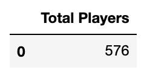
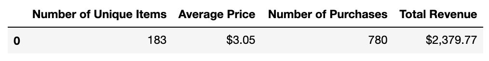
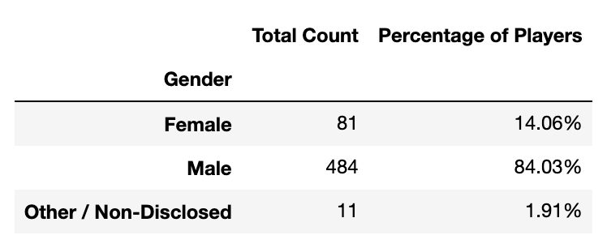
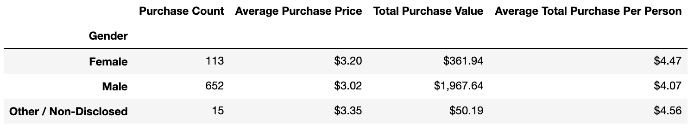
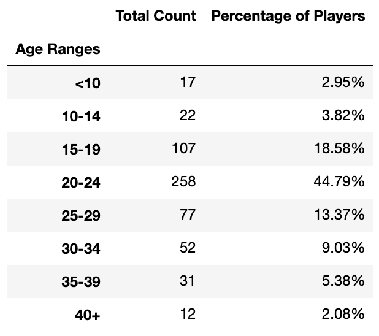
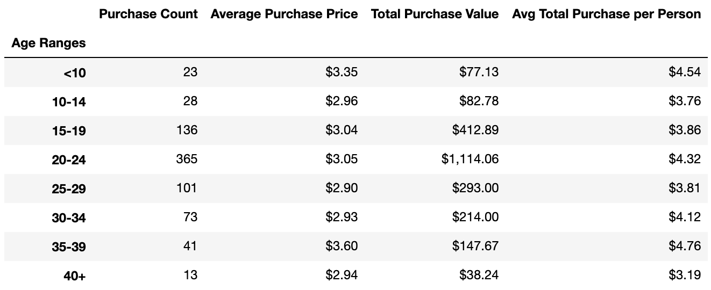
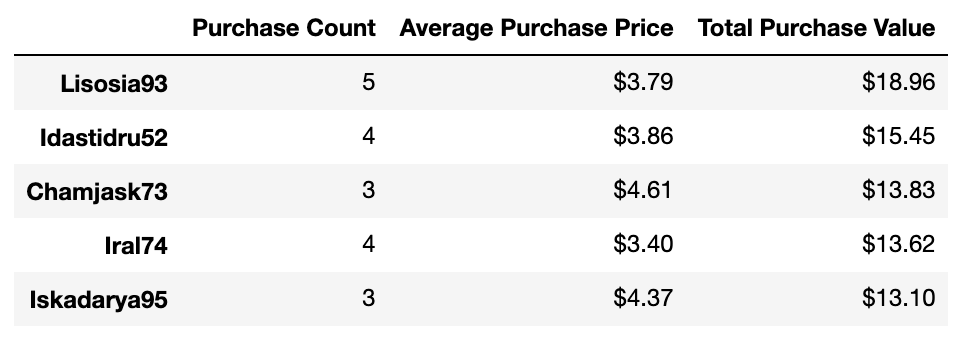
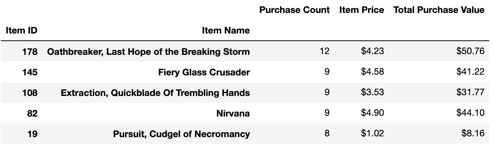
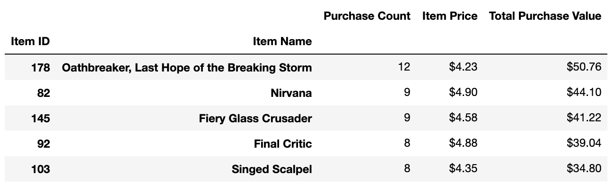

### Problem this analysis is trying to solve:
There is a large amount of data associated with this particular video game, so the purpose of this analysis is to organize that data into several different dataframes displaying statistics regaurding purchases, gender, age, and items. By doing so, several conclusions and patterns can be drawn in order to better market and sell the video game.

### How to run the code:
1. Download and save all the files in the folder "HerosOfPymoli" to a folder on your computer.
1. Open your terminal.
1. cd into the folder you saved the files in.
1. Run the command "jupyter notebook". This will open the folder in the Jupyter Notebook website.
1. Open up the Heroes_Of_Pymoli.ipynb file on Jupyter Notebook.
1. At the top, under the "Kernal" tab, click "Restart & Run All". This will run all the cells on the page and display all the dataframes.

### Data Collected:

### Why the data is displayed this way:
The data was organized into dataframes so that it is easy to view and make sense of. There are several different dataframes the data was organized into so that a variety of different information can be extracted from the data and therefore, a variety of conclusions can be drawn from it.

### Three observable trends based on the data are the following:

1. Many more males than females or other/non-disclosed buy items for this game. Males buy more than 5x the amount of items than females and other/non-disclosed combined.
2. The age group that buys the most about of items and spends the most amount of money for this game is 20-24 year olds. The amount of items bought and the amount of money spent decreases the older and younger the age range gets from 20-24. However, 35-39 year olds spend the most amount of money per person.
3. The age group with the most amount of players is 20-24 year olds. The amount of players decreases the older and younger the age range gets from 20-24.
